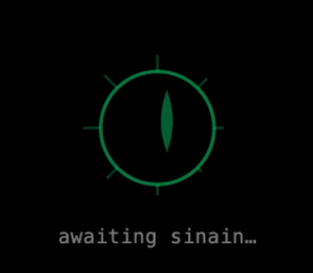

# Sinain

[](LICENSE)
[](https://github.com/anthillnet/sinain-hud/actions/workflows/ci.yml)
[](https://www.npmjs.com/package/@geravant/sinain)
[](https://support.apple.com/macos)
[](https://www.microsoft.com/windows)

Ambient intelligence that sees what you see, hears what you hear, and acts on your behalf.

<p align="center">
  
</p>

**[Quick Start](#quick-start)** · **[Docs](docs/)** · **[Privacy](docs/privacy-protection-design.md)** · **[Configuration](docs/CONFIGURATION.md)** · **[Contributing](CONTRIBUTING.md)**

---

### You, Augmented

AI tools today make you work for *them*. You copy context into chat windows, alt-tab to paste stack traces, explain what you're looking at. You are the middleware.

Sinain inverts this. Your screen, audio, clipboard — one continuous stream feeding your agent. Answers appear in a private HUD overlay, right where you work. When something needs doing, your agent acts — with tools, subagents, and the full power of Claude, Codex, or whatever you're running.

- Screen → OCR → context digest, continuous. Audio → transcription → awareness, real-time.
- HUD overlay: insights and actions appear *where you work*, not in a separate window.
- No copy-paste. No alt-tab. Your agent already has the context — and the tools to act on it.

### Your Agents. Your Stack. Your Rules.

Claude Code for deep reasoning. Codex for async tasks. Goose for local exploration. Junie for JetBrains. Every developer has a different stack — and it changes monthly.

Sinain doesn't pick a side. It's the nervous system that connects them all.

- Claude, Codex, Goose, Junie, Aider — they all get the same eyes and ears.
- Hot-swappable knowledge modules, portable across machines and sessions.
- OpenClaw gateway, sinain-agent standalone, MCP/ACP — your deployment, your choice.

### Cloud by Default. Local When It Matters.

Most days, cloud APIs are fast and practical. But when the stakes change — NDA project, client audit, classified codebase — you flip one switch and everything goes local. Same tool. Same workflow. Zero cloud.

- `off → standard → strict → paranoid` — four privacy modes, one config line.
- Paranoid: Ollama + whisper.cpp, zero network calls. Pull the ethernet cable. Still works.
- HUD invisible to screen capture (`NSWindow.sharingType = .none` on macOS, `WDA_EXCLUDEFROMCAPTURE` on Windows).
- BYOK, BYOM, BYOI — Bring Your Own Keys, Models, Infrastructure.

> Full messaging framework: [MESSAGING.md](https://github.com/Geravant/sinain/blob/main/projects/sinain-trailer/MESSAGING.md)

## Quick Start

```bash
npx @geravant/sinain start
```

That's it. On first run, sinain will:
1. Run an **interactive setup wizard** — transcription backend, API key, agent, privacy mode
2. **Auto-download** the overlay app, sck-capture binary, and Python dependencies
3. **Start all services** — sinain-core, sense_client, overlay, and agent

> **Re-run the wizard** anytime: `npx @geravant/sinain start --setup`

### Prerequisites

- **Node.js 18+** — [nodejs.org](https://nodejs.org/) (LTS recommended)
- **Python 3.10+** — `brew install python3` (macOS) or [python.org](https://www.python.org/downloads/)
- **OpenRouter API key** (optional for local-only mode) — [openrouter.ai](https://openrouter.ai)

> **Fully local?** No API key needed. Ollama + whisper-cli = zero cloud. See [Running Fully Local](#running-fully-local).

### macOS Permissions

1. **System Settings → Privacy & Security → Screen Recording** — add your Terminal
2. **System Settings → Privacy & Security → Microphone** — add your Terminal

### Managing sinain

```bash
npx @geravant/sinain stop             # stop all services
npx @geravant/sinain status           # check what's running
npx @geravant/sinain start --setup    # re-run setup wizard
npx @geravant/sinain start --no-sense # skip screen capture
npx @geravant/sinain start --no-overlay  # headless mode
```

## Architecture

```
┌─── Your Device ─────────────────────────────────────────────────────┐
│                                                                     │
│  sck-capture (Swift)                                                │
│    ├─ system audio (PCM) ──► sinain-core :9500                      │
│    └─ screen frames (JPEG) ──► sense_client ─── POST /sense ──►    │
│                                                      │              │
│                              ┌────────────────────────┘              │
│                              │                                      │
│                         sinain-core                                 │
│                           ├─ audio pipeline → transcription         │
│                           ├─ agent loop → digest + HUD text         │
│                           ├─ escalation ──► OpenClaw Gateway (WS)   │
│                           │                  or sinain-agent (poll)  │
│                           └─ WebSocket feed                         │
│                                  │                                  │
│                                  ▼                                  │
│                           overlay (Flutter)                         │
│                           private, invisible to screen capture      │
│                                                                     │
└─────────────────────────────────────────────────────────────────────┘
                                   │
                          ┌────────┴─────────┐
                          ▼                  ▼
                   OpenClaw Gateway    sinain-agent
                   (server or local)   (bare agent, no gateway)
                     ├─ sinain-hud plugin
                     │   └─ sinain-knowledge (curation, playbook, eval)
                     └─ SITUATION.md, Telegram alerts
```

## Components

| Component | Language | What it does | Docs |
|---|---|---|---|
| **sinain-core** | TypeScript | Central hub: audio pipeline, agent loop, escalation, WS feed | [README](sinain-core/README.md) |
| **overlay** | Dart / Swift / C++ | Private HUD (macOS + Windows), 4 display modes, hotkeys | [Hotkeys](docs/HOTKEYS.md) |
| **sense_client** | Python | Screen capture, SSIM diff, OCR, privacy filter | [sense_client/](sense_client/) |
| **sck-capture** | Swift | ScreenCaptureKit: system audio + screen frames | [tools/sck-capture/](tools/sck-capture/) |
| **sinain-agent** | Bash | Bare agent runner for Claude/Codex/Goose/Junie/Aider | [sinain-agent/](sinain-agent/) |
| **sinain-knowledge** | TypeScript | Curation, playbook, eval, portable knowledge modules | [Knowledge System](docs/knowledge-system.md) |
| **sinain-hud-plugin** | TypeScript | OpenClaw plugin: lifecycle, curation, overflow watchdog | [sinain-hud-plugin/](sinain-hud-plugin/) |
| **sinain-mcp-server** | TypeScript | MCP server exposing sinain tools to agents | [sinain-mcp-server/](sinain-mcp-server/) |

## Configuration

All config via `~/.sinain/.env` (created by the setup wizard).

| Variable | Default | Description |
|---|---|---|
| `OPENROUTER_API_KEY` | — | Required (unless fully local) |
| `ESCALATION_MODE` | `selective` | `off` / `selective` / `focus` / `rich` |
| `OPENCLAW_WS_URL` | `ws://localhost:18789` | Gateway WebSocket endpoint |
| `PRIVACY_MODE` | `off` | `off` / `standard` / `strict` / `paranoid` |

See [docs/CONFIGURATION.md](docs/CONFIGURATION.md) for the full reference (30+ variables).

## Privacy Modes

| Mode | What it does |
|---|---|
| `off` | All data flows freely — maximum insight quality |
| `standard` | Auto-redacts credentials before cloud APIs (wizard default) |
| `strict` | Only summaries leave your machine — no raw text sent to cloud |
| `paranoid` | Fully local: Ollama + whisper.cpp. Zero network calls. |

See [Privacy Threat Model](docs/privacy-protection-design.md) for the full design.

## Hotkeys

Global hotkeys use **Cmd+Shift** (macOS) or **Ctrl+Shift** (Windows):

| Shortcut | Action |
|---|---|
| `Cmd+Shift+Space` | Toggle overlay visibility |
| `Cmd+Shift+M` | Cycle display mode |
| `Cmd+Shift+/` | Open command input |
| `Cmd+Shift+H` | Quit overlay |

See [docs/HOTKEYS.md](docs/HOTKEYS.md) for all 15 shortcuts.

## Running Fully Local

No cloud APIs needed. Local models handle everything:

```bash
# 1. Install local transcription
./setup-local-stt.sh

# 2. Install Ollama + vision model
brew install ollama && ollama pull llava

# 3. Start in local mode
./start-local.sh
```

| Model | Size | Speed | Best for |
|---|---|---|---|
| `llava` | 4.7 GB | ~2s/frame | General use (recommended) |
| `llama3.2-vision` | 7.9 GB | ~4s/frame | Best accuracy |
| `moondream` | 1.7 GB | ~1s/frame | Fastest, lower quality |

## Setup Guides

| Setup | Guide |
|---|---|
| Local OpenClaw | [docs/INSTALL-LOCAL.md](docs/INSTALL-LOCAL.md) |
| Remote OpenClaw | [docs/INSTALL-REMOTE.md](docs/INSTALL-REMOTE.md) |
| NemoClaw (Brev) | [docs/INSTALL.md](docs/INSTALL.md) |
| Bare Agent | [docs/INSTALL-BARE-AGENT.md](docs/INSTALL-BARE-AGENT.md) |
| Windows | [setup-windows.sh](setup-windows.sh) |
| From Source | `git clone`, `cp .env.example ~/.sinain/.env`, `./start.sh` |

## Knowledge Transfer

```bash
npx @geravant/sinain export-knowledge   # export playbook, modules, graph
npx @geravant/sinain import-knowledge ~/sinain-knowledge-export.tar.gz
```

## Deep Dives

| Topic | Doc |
|---|---|
| Knowledge System | [docs/knowledge-system.md](docs/knowledge-system.md) |
| Escalation Architecture | [docs/clean-architecture-escalation.md](docs/clean-architecture-escalation.md) |
| Personality Traits | [docs/PERSONALITY-TRAITS-SYSTEM.md](docs/PERSONALITY-TRAITS-SYSTEM.md) |
| Privacy Threat Model | [docs/privacy-protection-design.md](docs/privacy-protection-design.md) |
| HUD Skill Protocol | [docs/HUD-SKILL-PROTOCOL.md](docs/HUD-SKILL-PROTOCOL.md) |
| Full Configuration | [docs/CONFIGURATION.md](docs/CONFIGURATION.md) |
| All Hotkeys | [docs/HOTKEYS.md](docs/HOTKEYS.md) |

## Contributing

See [CONTRIBUTING.md](CONTRIBUTING.md).

## License

MIT
